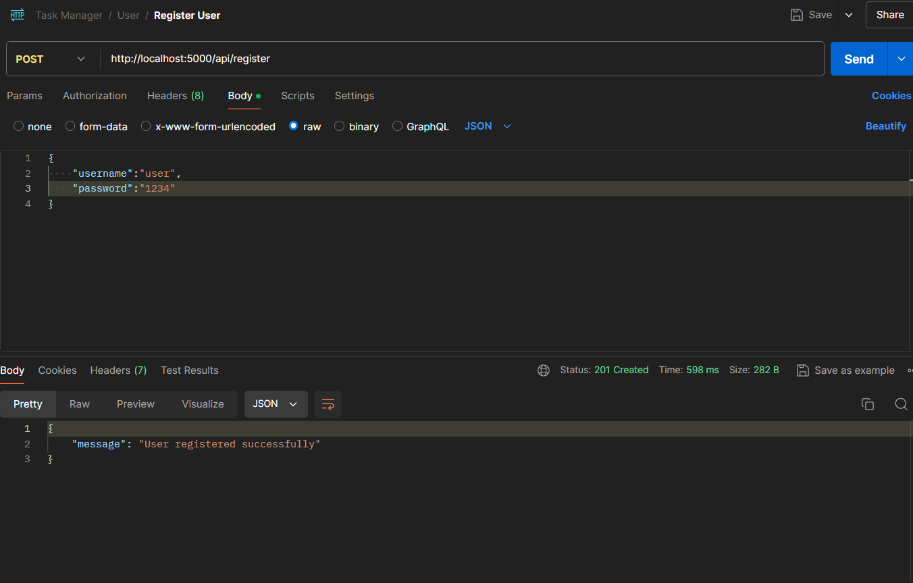
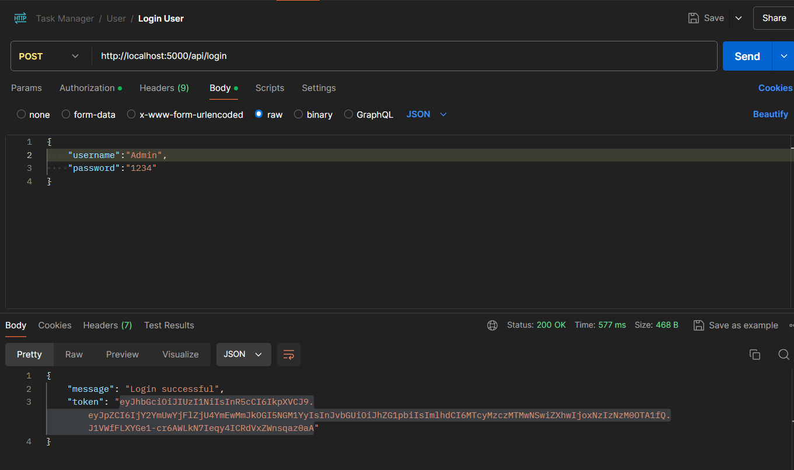
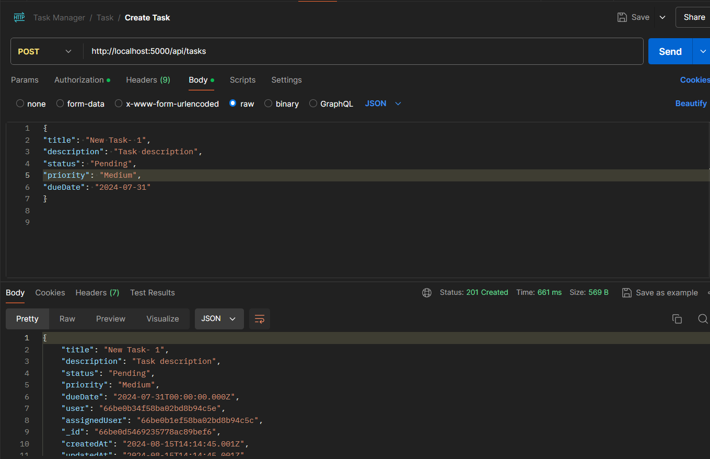
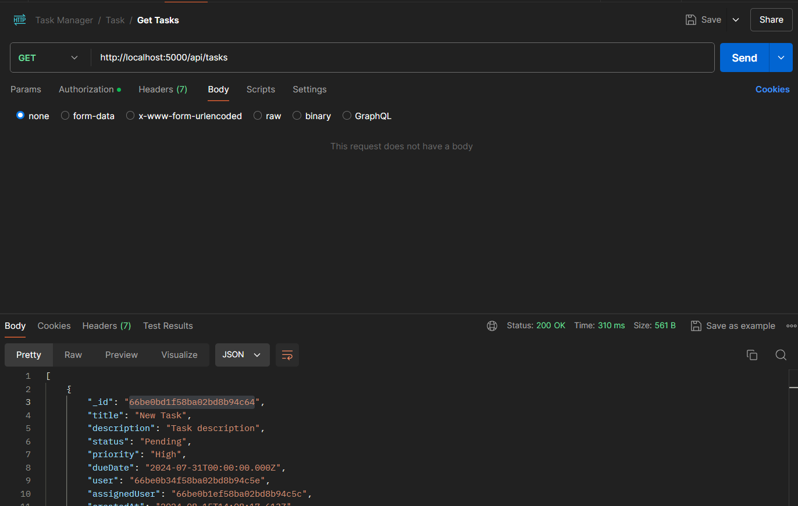
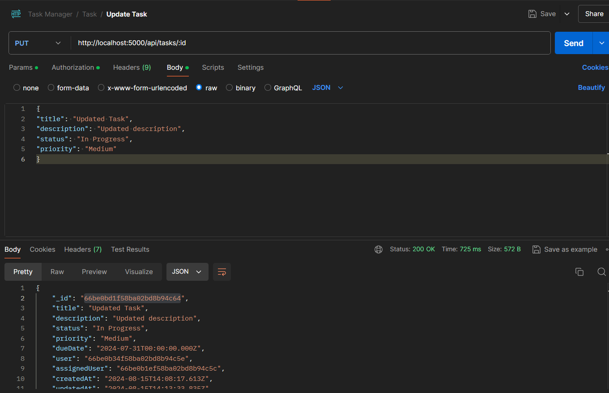
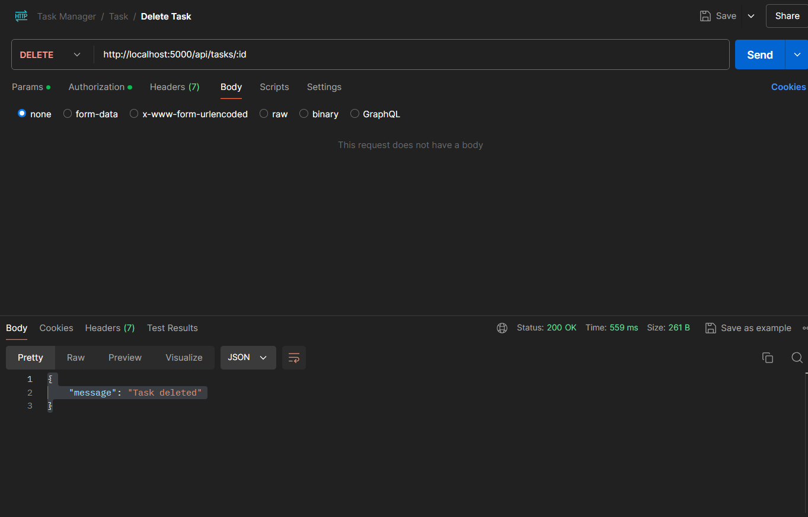

# Task Manager API
This API allows users to create, manage, and delete tasks. It supports authentication and authorization, ensuring that only authorized users can access or modify tasks. The API is built using Node.js, Express.js, and MongoDB.
## Getting Started
### Prerequisites
Before you begin, ensure you have the following installed:
- Node.js v14+
- MongoDB v4+
- npm v6+
### Installation
Clone the repository:
```
git clone https://github.com/D-4-DIBAKAR/Task-Manager-API.git
cd Task-Manager-API
```
Install dependencies:
```
npm install
```
### Environment Variables
Create a .env file in the root directory and add the following environment variables:
```
MONGODB_URI=<your-mongodb-connection-string>
JWT_SECRET=<your-jwt-secret>
PORT=5000
```
Replace `<your-mongodb-connection-string>` and `<your-jwt-secret>` with your actual MongoDB URI and JWT secret key.
## Run Server
```
npm start
```
## API Endpoints
### Authentication
- Register a New User
`POST /api/register
`
- Login
`POST /api/login
`
### Task Management
- Create a New Task
`POST /api/tasks
`
- Get Tasks
`GET /api/tasks
`

**Query Parameters (Optional):**

          1. status: Filter tasks by status (e.g., Pending, Completed)
          2. priority: Filter tasks by priority (e.g., High, Medium, Low)
          3. search: Search tasks by title or description
- Update a Task
`PUT /api/tasks/:id
`
- Delete a Task
`DELETE /api/tasks/:id
`

## Screenshots










